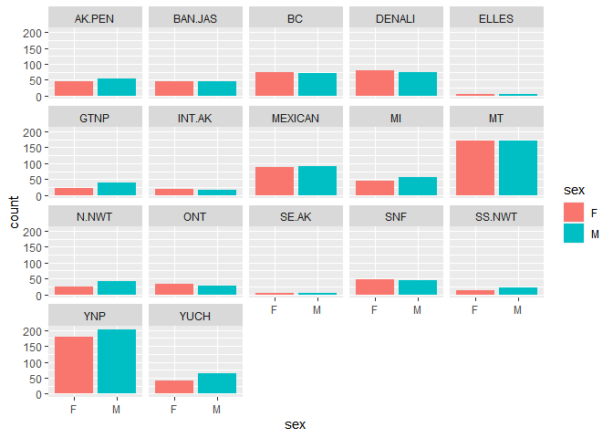

## Libraries

```r
library(tidyverse)
library(shiny)
library(shinydashboard)
```

## Wolves Example
Let's try to build an app that allows users to explore sexual composition of wolf packs by `pop`. These data are from: Brandell, Ellen E (2021), Serological dataset and R code for: Patterns and processes of pathogen exposure in gray wolves across North America, Dryad, [Dataset](https://doi.org/10.5061/dryad.5hqbzkh51)  

1. Start by loading and exploring the data.

```r
wolves <- read_csv("data/wolves_data/wolves_dataset.csv")
```

```
## Rows: 1986 Columns: 23
## ── Column specification ────────────────────────────────────────────────────────
## Delimiter: ","
## chr  (4): pop, age.cat, sex, color
## dbl (19): year, lat, long, habitat, human, pop.density, pack.size, standard....
## 
## ℹ Use `spec()` to retrieve the full column specification for this data.
## ℹ Specify the column types or set `show_col_types = FALSE` to quiet this message.
```


```r
names(wolves)
```

```
##  [1] "pop"                "year"               "age.cat"           
##  [4] "sex"                "color"              "lat"               
##  [7] "long"               "habitat"            "human"             
## [10] "pop.density"        "pack.size"          "standard.habitat"  
## [13] "standard.human"     "standard.pop"       "standard.packsize" 
## [16] "standard.latitude"  "standard.longitude" "cav.binary"        
## [19] "cdv.binary"         "cpv.binary"         "chv.binary"        
## [22] "neo.binary"         "toxo.binary"
```

2. For the app, here is a faceted version of what we are looking for. We want the reactive part to be `pop` and you should use `shinydashboard`.

```r
wolves %>% 
  filter(sex!="NA") %>% 
  ggplot(aes(x=sex, fill=sex))+
  geom_bar()+
  facet_wrap(~pop)
```

<!-- -->

```r
library(shiny)

ui <-dashboardPage(
  dashboardHeader(title ="Sexual Composition of Wolves by Population"),
  dashboardSidebar(disable= T),
  dashboardBody(
    fluidRow(
      box(title = "Population Options", width = 3,
        selectInput("x", "Select Population", choices = c("AK.PEN", "BAN.JAS", "BC", "DENALI", "ELLES", "GTNP", "INT.AK", "MEXICAN", "MI", "MT", "N.NWT", "ONT", "SE.AK", "SNF", "SS.NWT", "YNP", "YUCH"), selected = "AK.PEN"),
                plotOutput("plot", width= "600px", height = "500px")
  
))))

server <- function(input, output, session) {
  session$onSessionEnded(stopApp) 
  output$plot <- renderPlot({
    wolves %>% 
      filter(sex!= "NA") %>% 
      filter(pop== input$x) %>% 
      ggplot(aes(x=sex, fill= sex))+
      geom_bar(color= "black", alpha = 0.5)+
      theme_light()
      
  })
  
}

shinyApp(ui, server)
```

```{=html}
<div style="width: 100% ; height: 400px ; text-align: center; box-sizing: border-box; -moz-box-sizing: border-box; -webkit-box-sizing: border-box;" class="muted well">Shiny applications not supported in static R Markdown documents</div>
```

