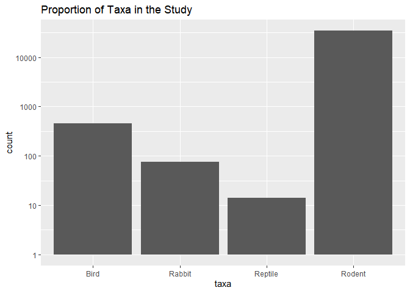
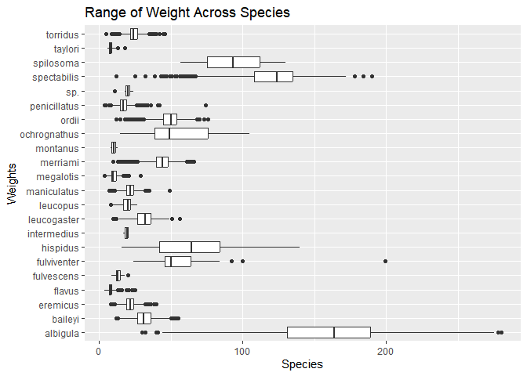
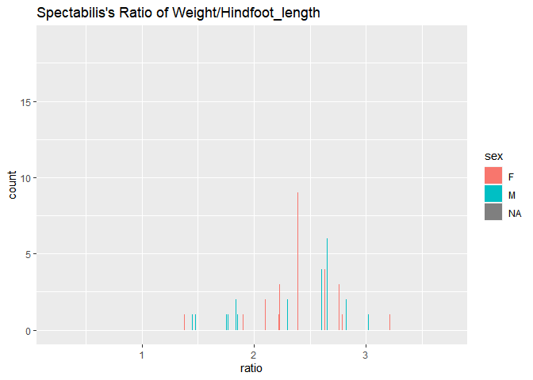
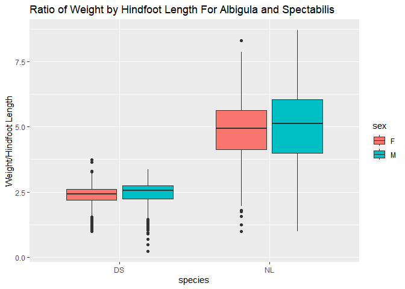

## Instructions
Answer the following questions and complete the exercises in RMarkdown. Please embed all of your code and push your final work to your repository. Your final lab report should be organized, clean, and run free from errors. Remember, you must remove the `#` for the included code chunks to run. Be sure to add your name to the author header above. For any included plots, make sure they are clearly labeled. You are free to use any plot type that you feel best communicates the results of your analysis.  

Make sure to use the formatting conventions of RMarkdown to make your report neat and clean!  

## Load the libraries

```r
library(tidyverse)
library(janitor)
library(here)
library(naniar)
```

## Desert Ecology
For this assignment, we are going to use a modified data set on [desert ecology](http://esapubs.org/archive/ecol/E090/118/). The data are from: S. K. Morgan Ernest, Thomas J. Valone, and James H. Brown. 2009. Long-term monitoring and experimental manipulation of a Chihuahuan Desert ecosystem near Portal, Arizona, USA. Ecology 90:1708.

```r
deserts <- read_csv(here("lab10", "data", "surveys_complete.csv"))
```

```
## Rows: 34786 Columns: 13
## ── Column specification ────────────────────────────────────────────────────────
## Delimiter: ","
## chr (6): species_id, sex, genus, species, taxa, plot_type
## dbl (7): record_id, month, day, year, plot_id, hindfoot_length, weight
## 
## ℹ Use `spec()` to retrieve the full column specification for this data.
## ℹ Specify the column types or set `show_col_types = FALSE` to quiet this message.
```

1. Use the function(s) of your choice to get an idea of its structure, including how NA's are treated. Are the data tidy?  

```r
glimpse(deserts)
```

```
## Rows: 34,786
## Columns: 13
## $ record_id       <dbl> 1, 2, 3, 4, 5, 6, 7, 8, 9, 10, 11, 12, 13, 14, 15, 16,…
## $ month           <dbl> 7, 7, 7, 7, 7, 7, 7, 7, 7, 7, 7, 7, 7, 7, 7, 7, 7, 7, …
## $ day             <dbl> 16, 16, 16, 16, 16, 16, 16, 16, 16, 16, 16, 16, 16, 16…
## $ year            <dbl> 1977, 1977, 1977, 1977, 1977, 1977, 1977, 1977, 1977, …
## $ plot_id         <dbl> 2, 3, 2, 7, 3, 1, 2, 1, 1, 6, 5, 7, 3, 8, 6, 4, 3, 2, …
## $ species_id      <chr> "NL", "NL", "DM", "DM", "DM", "PF", "PE", "DM", "DM", …
## $ sex             <chr> "M", "M", "F", "M", "M", "M", "F", "M", "F", "F", "F",…
## $ hindfoot_length <dbl> 32, 33, 37, 36, 35, 14, NA, 37, 34, 20, 53, 38, 35, NA…
## $ weight          <dbl> NA, NA, NA, NA, NA, NA, NA, NA, NA, NA, NA, NA, NA, NA…
## $ genus           <chr> "Neotoma", "Neotoma", "Dipodomys", "Dipodomys", "Dipod…
## $ species         <chr> "albigula", "albigula", "merriami", "merriami", "merri…
## $ taxa            <chr> "Rodent", "Rodent", "Rodent", "Rodent", "Rodent", "Rod…
## $ plot_type       <chr> "Control", "Long-term Krat Exclosure", "Control", "Rod…
```
The data is tidy and NAs are presented in the data as empty cells

2. How many genera and species are represented in the data? What are the total number of observations? Which species is most/ least frequently sampled in the study?


```r
deserts %>% 
  count(genus, sort =T)
```

```
## # A tibble: 26 × 2
##    genus                n
##    <chr>            <int>
##  1 Dipodomys        16167
##  2 Chaetodipus       6029
##  3 Onychomys         3267
##  4 Reithrodontomys   2694
##  5 Peromyscus        2234
##  6 Perognathus       1629
##  7 Neotoma           1252
##  8 Ammospermophilus   437
##  9 Amphispiza         303
## 10 Spermophilus       249
## # … with 16 more rows
```
26 genera and 40 species, 

```r
deserts %>% 
  count(species, sort =T)
```

```
## # A tibble: 40 × 2
##    species          n
##    <chr>        <int>
##  1 merriami     10596
##  2 penicillatus  3123
##  3 ordii         3027
##  4 baileyi       2891
##  5 megalotis     2609
##  6 spectabilis   2504
##  7 torridus      2249
##  8 flavus        1597
##  9 eremicus      1299
## 10 albigula      1252
## # … with 30 more rows
```
The species most frequently studied is merriami and the species the least studied are the clarki, scutalatus, tereticaudus, tigris, uniparens, and viridis.


3. What is the proportion of taxa included in this study? Show a table and plot that reflects this count.

```r
deserts %>% 
  ggplot(aes(x=taxa))+
  geom_bar()+
  scale_y_log10()+
  labs(title= "Proportion of Taxa in the Study")
```

<!-- -->

```r
deserts %>% 
  tabyl(taxa)
```

```
##     taxa     n      percent
##     Bird   450 0.0129362387
##   Rabbit    75 0.0021560398
##  Reptile    14 0.0004024608
##   Rodent 34247 0.9845052607
```


4. For the taxa included in the study, use the fill option to show the proportion of individuals sampled by `plot_type.`

```r
deserts %>% 
  ggplot(aes(x=taxa, fill = plot_type))+
  geom_bar(position="dodge")+
  scale_y_log10()+
  labs(title= "Proportion of Individuals in Taxa by plot type")
```

<!-- -->

5. What is the range of weight for each species included in the study? Remove any observations of weight that are NA so they do not show up in the plot.

```r
names(deserts)
```

```
##  [1] "record_id"       "month"           "day"             "year"           
##  [5] "plot_id"         "species_id"      "sex"             "hindfoot_length"
##  [9] "weight"          "genus"           "species"         "taxa"           
## [13] "plot_type"
```


```r
deserts %>% 
  filter(weight!="NA") %>% 
  ggplot(aes(x=species, y=weight))+
  geom_boxplot()+
  coord_flip()+
  labs(title="Range of Weight Across Species",
       x= "Weights",
       y="Species")
```

<!-- -->

6. Add another layer to your answer from #4 using `geom_point` to get an idea of how many measurements were taken for each species.

```r
deserts %>% 
  filter(weight!="NA") %>% 
  ggplot(aes(x=species, y=weight))+
  geom_boxplot()+
  geom_point()+
  coord_flip()+
  labs(title="Range of Weight Across Species",
       x= "Weights",
       y="Species")
```

<!-- -->

7. [Dipodomys merriami](https://en.wikipedia.org/wiki/Merriam's_kangaroo_rat) is the most frequently sampled animal in the study. How have the number of observations of this species changed over the years included in the study?

```r
deserts_merriami <- deserts%>% 
  filter(genus== "merriami")
```


```r
deserts_merriami %>% 
  count(year) %>% 
  ggplot(aes(x=year, y= n)) +
  geom_col() +
  labs(title = "Number of Observations for Dipodomys Merriami over the years", 
       y= "Number of Observations", x = "Year")
```

<!-- -->


8. What is the relationship between `weight` and `hindfoot` length? Consider whether or not over plotting is an issue.


```r
deserts %>% 
  ggplot(aes(x=hindfoot_length, y=weight)) +
  geom_point() +
  geom_smooth(method=lm, se=F)+
  labs(title ="Hindfoot length versus Weight",
       x= "Hindfoot Length",
       y= "Weight")
```

```
## `geom_smooth()` using formula = 'y ~ x'
```

```
## Warning: Removed 4048 rows containing non-finite values (`stat_smooth()`).
```

```
## Warning: Removed 4048 rows containing missing values (`geom_point()`).
```

<!-- -->
In general there is a positive correlation.

9. Which two species have, on average, the highest weight? Once you have identified them, make a new column that is a ratio of `weight` to `hindfoot_length`. Make a plot that shows the range of this new ratio and fill by sex.


```r
names(deserts)
```

```
##  [1] "record_id"       "month"           "day"             "year"           
##  [5] "plot_id"         "species_id"      "sex"             "hindfoot_length"
##  [9] "weight"          "genus"           "species"         "taxa"           
## [13] "plot_type"
```


```r
deserts %>% 
  group_by(species) %>% 
  filter(!is.na(weight)) %>% 
  summarize(avg_weight = mean(weight,na.rm =T)) %>% 
  arrange(desc(avg_weight))
```

```
## # A tibble: 22 × 2
##    species      avg_weight
##    <chr>             <dbl>
##  1 albigula          159. 
##  2 spectabilis       120. 
##  3 spilosoma          93.5
##  4 hispidus           65.6
##  5 fulviventer        58.9
##  6 ochrognathus       55.4
##  7 ordii              48.9
##  8 merriami           43.2
##  9 baileyi            31.7
## 10 leucogaster        31.6
## # … with 12 more rows
```

```r
deserts_albigula <- deserts %>% 
  filter(species == "albigula") %>% 
  mutate(ratio = weight/hindfoot_length)
deserts_albigula
```

```
## # A tibble: 1,252 × 14
##    record…¹ month   day  year plot_id speci…² sex   hindf…³ weight genus species
##       <dbl> <dbl> <dbl> <dbl>   <dbl> <chr>   <chr>   <dbl>  <dbl> <chr> <chr>  
##  1        1     7    16  1977       2 NL      M          32     NA Neot… albigu…
##  2        2     7    16  1977       3 NL      M          33     NA Neot… albigu…
##  3       22     7    17  1977      15 NL      F          31     NA Neot… albigu…
##  4       38     7    17  1977      17 NL      M          33     NA Neot… albigu…
##  5       72     8    19  1977       2 NL      M          31     NA Neot… albigu…
##  6      106     8    20  1977      12 NL      <NA>       NA     NA Neot… albigu…
##  7      107     8    20  1977      18 NL      <NA>       NA     NA Neot… albigu…
##  8      121     8    21  1977      15 NL      <NA>       NA     NA Neot… albigu…
##  9      171     9    11  1977      12 NL      <NA>       NA     NA Neot… albigu…
## 10      194     9    12  1977      11 NL      <NA>       NA     NA Neot… albigu…
## # … with 1,242 more rows, 3 more variables: taxa <chr>, plot_type <chr>,
## #   ratio <dbl>, and abbreviated variable names ¹​record_id, ²​species_id,
## #   ³​hindfoot_length
```

```r
deserts_albigula %>% 
  ggplot(aes(x=ratio, fill= sex))+
  geom_bar(position="dodge")+
  labs(title = "Albigula's Ratio of Weight/Hindfoot_length")
```

```
## Warning: Removed 206 rows containing non-finite values (`stat_count()`).
```

<!-- -->

```r
deserts_spectabilis <-deserts %>% 
  filter(species == "spectabilis") %>% 
  mutate(ratio = weight/hindfoot_length) 
deserts_spectabilis
```

```
## # A tibble: 2,504 × 14
##    record…¹ month   day  year plot_id speci…² sex   hindf…³ weight genus species
##       <dbl> <dbl> <dbl> <dbl>   <dbl> <chr>   <chr>   <dbl>  <dbl> <chr> <chr>  
##  1       11     7    16  1977       5 DS      F          53     NA Dipo… specta…
##  2       17     7    16  1977       3 DS      F          48     NA Dipo… specta…
##  3       20     7    17  1977      11 DS      F          48     NA Dipo… specta…
##  4       30     7    17  1977      10 DS      F          52     NA Dipo… specta…
##  5       42     7    18  1977      18 DS      F          46     NA Dipo… specta…
##  6       58     7    18  1977      12 DS      M          45     NA Dipo… specta…
##  7       73     8    19  1977       3 DS      F          44     NA Dipo… specta…
##  8       76     8    19  1977       9 DS      F          47     NA Dipo… specta…
##  9       80     8    19  1977       1 DS      M          48     NA Dipo… specta…
## 10       91     8    20  1977      11 DS      F          50     NA Dipo… specta…
## # … with 2,494 more rows, 3 more variables: taxa <chr>, plot_type <chr>,
## #   ratio <dbl>, and abbreviated variable names ¹​record_id, ²​species_id,
## #   ³​hindfoot_length
```

```r
deserts_spectabilis %>% 
  ggplot(aes(x=ratio, fill= sex))+
  geom_bar(position="dodge")+
  labs(title = "Spectabilis's Ratio of Weight/Hindfoot_length")
```

```
## Warning: Removed 478 rows containing non-finite values (`stat_count()`).
```

<!-- -->

```r
deserts %>% 
  filter(species == "albigula"| species == "spectabilis") %>% 
  mutate(ratio = weight/hindfoot_length) %>% 
  ggplot(aes(x=species, y= ratio, fill= sex)) +
  geom_boxplot(na.rm=T)
```

<!-- -->


10. Make one plot of your choice! Make sure to include at least two of the aesthetics options you have learned.


```r
names(deserts)
```

```
##  [1] "record_id"       "month"           "day"             "year"           
##  [5] "plot_id"         "species_id"      "sex"             "hindfoot_length"
##  [9] "weight"          "genus"           "species"         "taxa"           
## [13] "plot_type"
```

```r
deserts %>% 
  ggplot(aes(x=weight,y= sex, fill= sex))+
  geom_col() +
  coord_flip() +
  labs(title= "Weight by Sex for Species")+
  theme(axis.text.y = element_text(angle = 60, hjust = 1))
```

```
## Warning: Removed 2503 rows containing missing values (`position_stack()`).
```

<!-- -->


## Push your final code to GitHub!
Please be sure that you check the `keep md` file in the knit preferences. 
